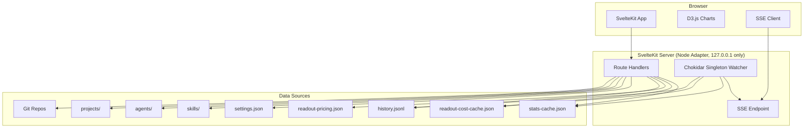

# Claudeitor: Coding Activity Dashboard

## Overview

A localhost-only SvelteKit + Svelte 5 web dashboard that reads from ~/.claude/ and git repos to present a rich, interactive overview of coding activity, session history, costs, repo health, and Claude Code configuration. Single-user, no auth, no deployment.

## Scope

### In Scope (V1)
- **11 full pages**: Readout, Live, Sessions (list + detail/replay), Costs, Repos, Timeline, Skills, Agents, Memory, Hooks, Settings
- **Stub pages**: Work Graph, Repo Pulse, Diffs, Snapshots, Hygiene, Deps, Worktrees, Env, Lint, Setup, Ports, Extensions
- **Real-time SSE** on Readout page via sveltekit-sse (Readout only; Live page uses polling)
- **D3.js interactive charts** (Activity 30d, When You Work, Cost by Model)
- **Session replay** with scrubable timeline (messages + timestamps core; file diffs best-effort)
- **AI summaries** via Anthropic SDK (configurable model, cached locally)
- **Cmd+K command palette** via Bits UI Command component
- **Snooze-able alerts** for repo hygiene issues
- **System light/dark theme** via Tailwind v4 CSS-first config

### Out of Scope
- Pi-agent extensions (deferred epic)
- Mobile-first design (responsive but desktop-primary)
- Multi-user / auth / deployment
- Database (pure filesystem reads)

## Architecture



## Data Strategy

1. **Cache-first**: Read stats-cache.json, readout-cost-cache.json, readout-pricing.json
2. **JSONL fallback**: Parse history.jsonl when caches unavailable
3. **Model ID mapping** (multi-strategy): exact match, regex extraction, normalization against pricing keys, fallback to raw ID
4. **Split git caching**: Commit log cached by HEAD hash; working-tree status always refreshed (sub-second git status --porcelain)
5. **File watching**: Chokidar singleton on globalThis, awaitWriteFinish for atomic reads
6. **SSE push**: File change events push to Readout page only; Live page uses polling

## Security

- **Server bound to 127.0.0.1** (never 0.0.0.0) in both dev and production
- **API key server-only**: never returned to client, server exposes hasApiKey boolean only
- **Config in .gitignore**: claudeitor.config.json contains API key, committed as .example only
- **No auth needed**: localhost-only, single-user

## Key Technical Decisions

1. sveltekit-sse library for SSE (not raw EventSource)
2. Bits UI Command for Cmd+K palette (cmdk-sv is deprecated)
3. D3.js for charts (maximum flexibility, SVG-based)
4. Chokidar singleton watcher (globalThis guarded, reference-counted connections)
5. Node adapter (persistent server required for SSE + file watching)
6. Dashboard state in localStorage (snoozed alerts, chart prefs, theme override)
7. AI summary cache in ~/.claude/projects/<project>/claudeitor-cache/
8. Config file: claudeitor.config.json in project root (.gitignored)
9. Tailwind v4 via @tailwindcss/vite plugin with @import, @source, @theme directives
10. Split git caching: expensive data by HEAD, cheap working-tree always fresh
11. Live page polling (not SSE) to contain SSE scope
12. Session replay MVP: messages + timestamps core, file diffs best-effort

## Risks & Mitigations

| Risk | Mitigation |
|------|-----------|
| Model ID mapping breaks on new models | Multi-strategy: exact, regex, normalization, fallback |
| Concurrent cache writes corrupt reads | Chokidar awaitWriteFinish + JSON parse try/catch |
| Large session files crash replay | Chunked/streaming reads, pagination |
| ~/.claude/ format changes | Version detection, graceful degradation per-feature |
| Active session detection fragile | Combine process detection + file timestamp heuristics |
| LAN exposure of sensitive data | Server bound to 127.0.0.1, API key server-only |
| Duplicate watchers on HMR | globalThis singleton with reference counting |

## Quick Commands

```bash
# Install dependencies
pnpm install

# Dev server
pnpm dev

# Type check
pnpm check

# Run tests
pnpm test

# Build
pnpm build
```

## Acceptance

- [ ] SvelteKit + Svelte 5 project with Tailwind v4 (@tailwindcss/vite), D3.js, TypeScript strict
- [ ] Server bound to 127.0.0.1 in dev and production
- [ ] Readout page with responsive grid matching reference screenshot
- [ ] Top stat cards with real data and trend indicators
- [ ] Activity (30d), When You Work, Cost by Model charts (interactive D3.js)
- [ ] Recent Sessions with real data from history.jsonl
- [ ] Snooze-able alerts for hygiene issues
- [ ] SSE real-time updates on Readout page (singleton watcher)
- [ ] All 11 full pages with real data
- [ ] All stub pages with Coming Soon placeholder
- [ ] Sidebar navigation with all sections
- [ ] Cmd+K command palette with fuzzy search
- [ ] Session detail with metadata + AI summary (cached, server-only API key)
- [ ] Session replay with scrubable timeline (messages core, diffs best-effort)
- [ ] Settings page (API key server-only, repo dirs, theme, model, cost thresholds)
- [ ] System light/dark theme
- [ ] Config file (.gitignored, .example committed)
- [ ] Vitest unit tests for data layer
- [ ] Empty states with guidance
- [ ] Cache-first loading: no full history parsing when caches present

## References

- Spec: .flow/specs/fn-1-claudeitor-coding-activity-dashboard.md
- Reference SvelteKit project: ~/Development/code/Hasura/PromptQL-Code/ThreadErrorAnalyzer/
- User skills: svelte-runes, sveltekit-data-flow, tailwind-v4-shadcn, d3js, clean-web-design
- Data sources: ~/.claude/stats-cache.json, readout-cost-cache.json, readout-pricing.json, history.jsonl
